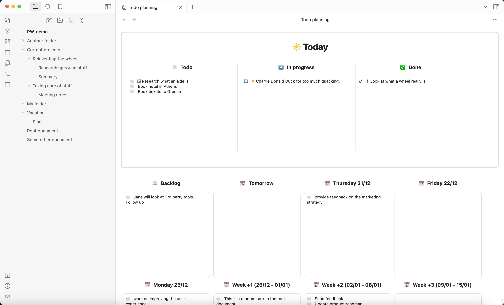
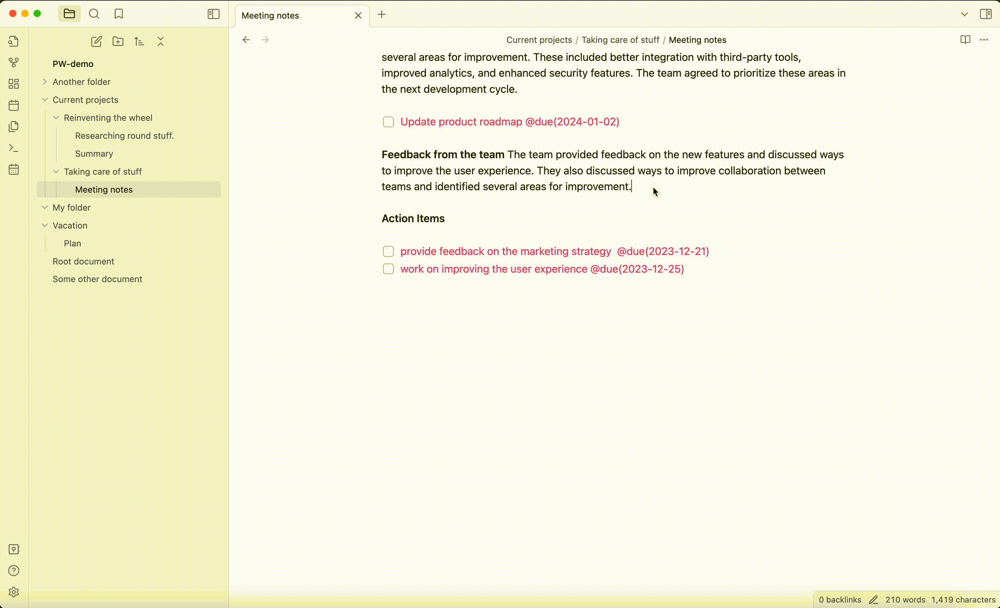

# This is Proletarian Wizard, a task manager for Obsidian

_Track your tasks across all the notes in your workspace. Organize your day. Plan your work._

This is Proletarian Wizard's task board:

Enter tasks directly in your notes. Everything goes together, you can keep your to-dos right at their source, alongside everything else. When you enter a todo, it magically appears in PW's task board.

The top thread panels allow you to track your day. You start by selecting the tasks you want to do, optionally prioritize them. Then as you work on them, you can change their status, and finally mark them done.

Updates are working in both directions. Changing tasks on the board updates them in your notes, and vice-versa. Click on a task to see it in its note.

The panels below allow you to plan your work. When we get to that date, the tasks will automatically show up in the "Todo" column of today. If you don't complete tasks, they will show in a new panel called "Past". You can decide what to do with these later.

You can also use the auto-expand shortcut (alt+.) to replace natural language to an actual date (e.g. try _tomorrow_, _next monday_, or _next month_). Easier than having to calculate dates.

Produce a report of all the work you did, to help with status reports, and annual reviews.

